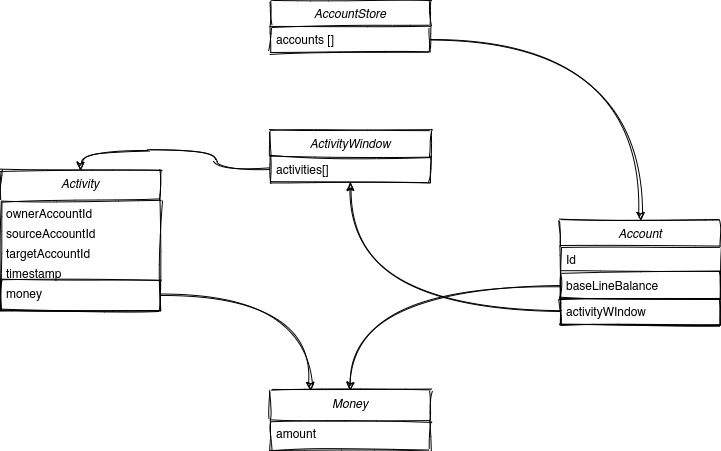

# Design Patterns Course: Creational Patterns Laboratory

For this laboratory work I choose to implement an abstract financial system with accounts, transactions
and global state store for accounts.

## Classes Diagram

## Used Design Patterns

In this project I've used:
* Singleton: for AccountStore to provide unique data store for the whole application
* Simple Factory: for AccountEntity (`AccountEntityFactory` class) to make simpler creation of new Account
* Prototype: for AccountEntity (`clone` method) in order to create new Account easier