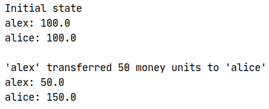

# Design Patterns Course: Creational Patterns Laboratory

## Author

Alexandru Calugari FAF-181 [@afishr](github.com/afishr)

## Topic

Creational Design Patterns. Implementation and usage.

## Introduction

This laboratory work implements an abstract financial system with accounts, transactions
and global state store for accounts.

## Theory

In software engineering, the creational design patterns are the general solutions that deal with object creation, trying to create objects in a manner suitable to the situation. The basic form of object creation could result in design problems or added complexity to the design. Creational design patterns solve this problem by optimizing, hiding or controlling the object creation.

Some examples of this kind of design patterns are :

* Singleton
* Builder
* Prototype
* Object Pooling
* Factory Method
* Abstract Factory

## Implementation

### Classes Diagram


### Used Design Patterns

This project implements the following patterns:
* Singleton: for AccountStore to provide unique data store for the whole application
* Simple Factory: for AccountEntity (`AccountEntityFactory` class) to make simpler creation of new Account
* Prototype: for AccountEntity (`copy` method) in order to create new Account easier

#### Singleton:
>**AccountStore.java**
```java
// Static instace variable
private static AccountsStore instance = null;

// Private constructor
private AccountsStore() {
  accounts = new ArrayList<AccountEntity>();
}

// getInstance method returns new instance or the existing one
public static AccountsStore getInstance() {
  if (instance == null) {
    instance = new AccountsStore();
  }

  return instance;
}
```

#### Simple Factory:
>**AccountEntityFactory.java**
```java
// makeAccountEntity method returns new AccountEntity
public static AccountEntity makeAccountEntity(String accountId, Double initialBalance) {
  return new AccountEntity(accountId, MoneyEntity.of(initialBalance), new ActivityWindowEntity(new ArrayList<ActivityEntity>()));
}
```

#### Prototype:
>**AccountEntity.java**
```java
// copy method returns new AccountEntity as a copy of original
public AccountEntity copy(String newAccountId) {
  AccountEntity newAccount = AccountEntityFactory.makeAccountEntity(newAccountId, this.baseLineBalance.getAmount());
  newAccount.activityWindow = new ActivityWindowEntity(new ArrayList<ActivityEntity>(this.activityWindow.getActivities()));

  return newAccount;
}
```

## Results
>**Driver code**
```java
/* Simple Factory design pattern */
AccountEntity a = AccountEntityFactory.makeAccountEntity("alex", 100d);

/* Singleton design pattern pt.1 */
AccountsStore store = AccountsStore.getInstance();

store.add(a);

/* Prototype design pattern */
store.add(a.copy("alice"));
  
/* ... */

/* Singleton design pattern pt.2 */
AccountsStore another_store = AccountsStore.getInstance();

AccountEntity alex = another_store.getAccountById("alex");
AccountEntity alice = another_store.getAccountById("alice");

System.out.println("Initial state");
logAccountState(alex);
logAccountState(alice);

transferMoney(alex, alice, 50d);

System.out.println();

System.out.println("'alex' transferred 50 money units to 'alice'");
logAccountState(alex);
logAccountState(alice);
```

>**Execution results**

